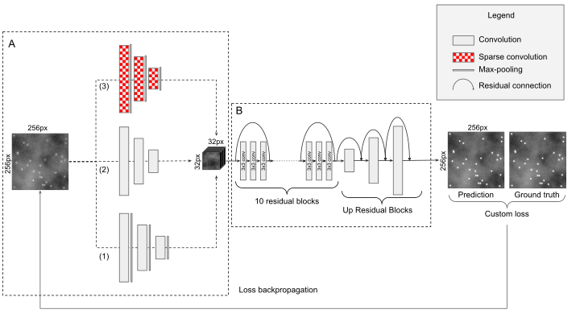
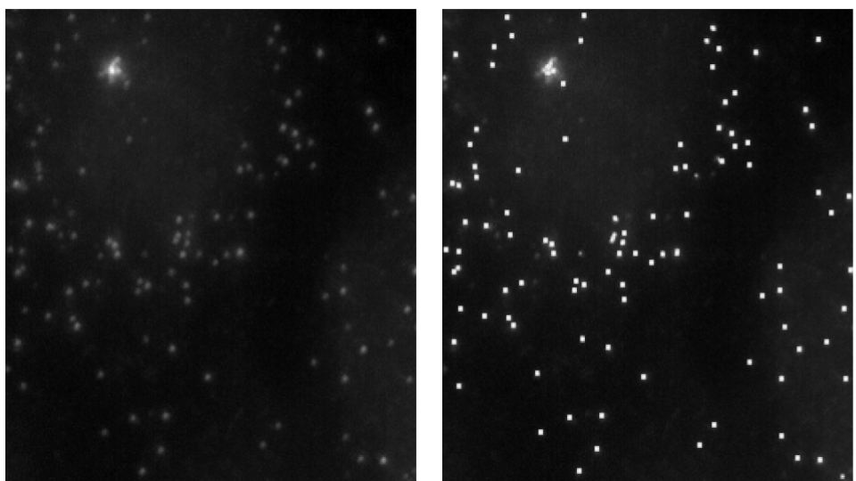

# DeepSpot

**DeepSpot** is a CNN (Convolutional Neural Network) dedicated to the enhancement of fluorescent spots in microscopy images,
enabling downstream mRNA spot detection using commonly used tools without need for parameter fine-tuning.
 **DeepSpot** is based on a multi-network architecture, using Atrou convolution (A) for context reasonning and a twisted ResNet 
architecture (B) to automatically enhance the mRNA spots in images. 

| DeepSpot Network Architecture|
| ------------- |
|  |
|  |

## Installation
Clone the repository from [github](https://github.com/cbib/DeepSpot)

`git clone https://github.com/cbib/deepspot.git`

### Install dependencies with Conda 
DeepSpot requires Python >= 3.6 and TensorFlow >= 2.2.

To use a tested environment :

`conda env create deepspot.yaml`

Then activate the environment:

`conda activate deepspot`

## Usage

### Code organization
DeepSpot is organized as a Python package :

* [dataset.py](https://github.com/cbib/DeepSpot/blob/master/deepspot/dataset.py) to generate dataset of paired images (raw images and ground truth)

* [global_var.py](https://github.com/cbib/DeepSpot/blob/master/deepspot/global_var.py) is the config file containing data paths and training variables (batch size, learning rate...)

* [network.py](https://github.com/cbib/DeepSpot/blob/master/deepspot/network.py) contains the architecture of the network

* [predict.py](https://github.com/cbib/DeepSpot/blob/master/deepspot/predict.py) used for prediction when the network is trained

* [residual_blocks.py](https://github.com/cbib/DeepSpot/blob/master/deepspot/residual_blocks.py) contains residual blocks called by the network

* [train.py](https://github.com/cbib/DeepSpot/blob/master/deepspot/train.py) to train the network

### Configuration file

To launch you own training and prediction, [global_var.py](https://github.com/cbib/DeepSpot/blob/master/deepspot/global_var.py) needs to be updated according to your needs.

The default configuration is the one giving the best results according to the HyperParameter search performed with Ray Tune.
However, if needed you can change the number of epochs, batch size, image size, learning rate, dropout rate, number of filters...)

**Check and update the paths to the data before training.**

### Training

Before training, if you have multiple GPUs, please set the cuda visible device variable to the desired GPU id, for example 0 :
`os.environ["CUDA_VISIBLE_DEVICES"] = "0"`

Then launch the training with 

`python train.py`

The training will output a model (the model name can be set in [global_var.py](https://github.com/cbib/DeepSpot/blob/master/deepspot/global_var.py))

### Prediction
Be sure to have set :
* The right path to the data to be predicted
* The right path to the model you want to use

Then launch

`python predict.py`

The prediction will output the predicted images in a /prediction folder under the prediction path set in [global_var.py](https://github.com/cbib/DeepSpot/blob/master/deepspot/global_var.py)

### Use an existing model

To use our best model for prediction let the `save_model_folder` default value or `save_model_folder = "models/Mmixed/"` in [global_var.py](https://github.com/cbib/DeepSpot/blob/master/deepspot/global_var.py)

Then launch

`python predict.py`

## Support
If you have any question relative to the repository, please open an [issue](https://github.com/cbib/deepspot). 
You can also contact [Emmanuel Bouilhol](mailto:emmanuel.bouilhol[AT]u-bordeaux.fr).

## Contributiting
Contributions are very welcome. Please use [Pull requests](https://github.com/cbib/deepspot/pulls).
For major changes, please open an [issue](https://github.com/cbib/deepspot)  first to discuss what you would like to change.

